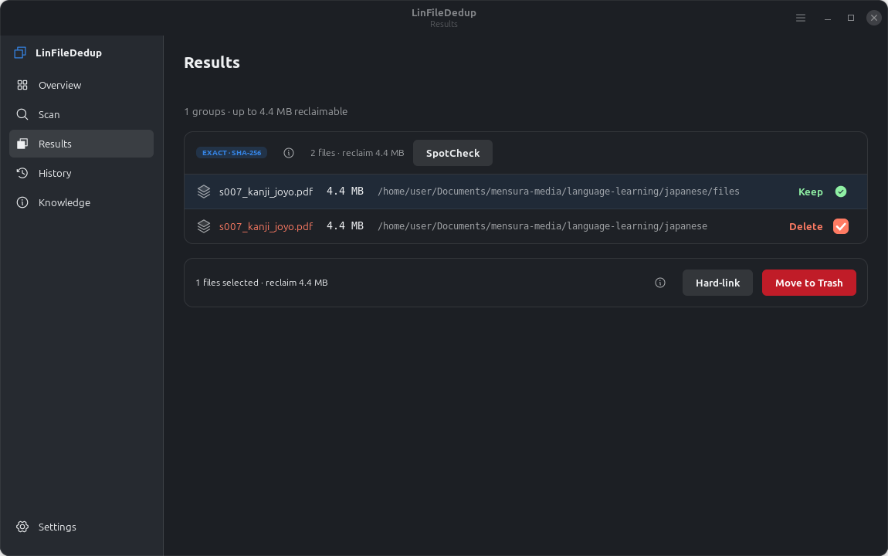
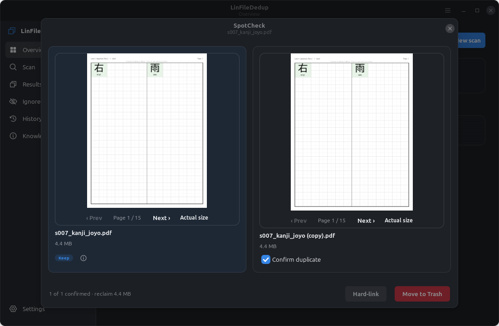
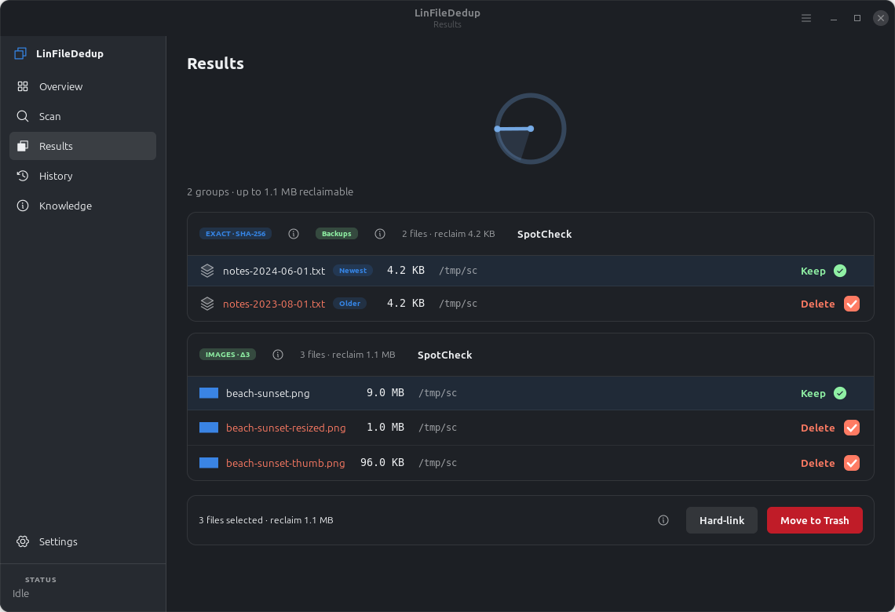
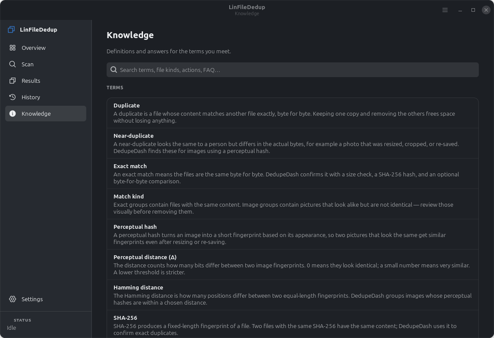
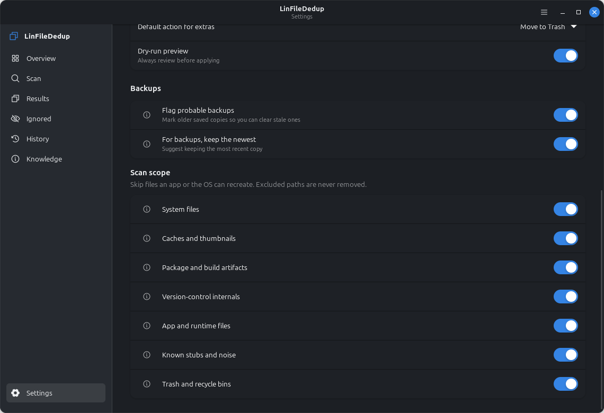
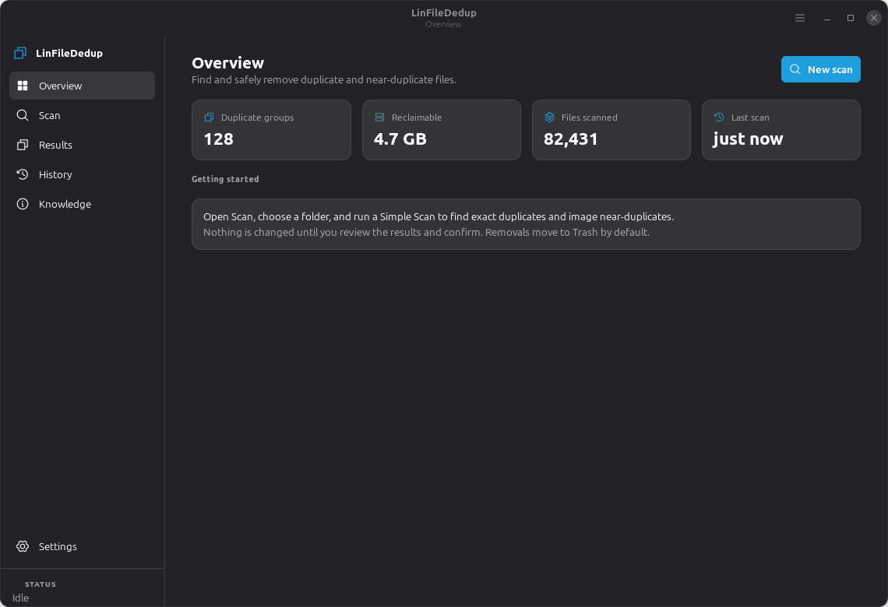
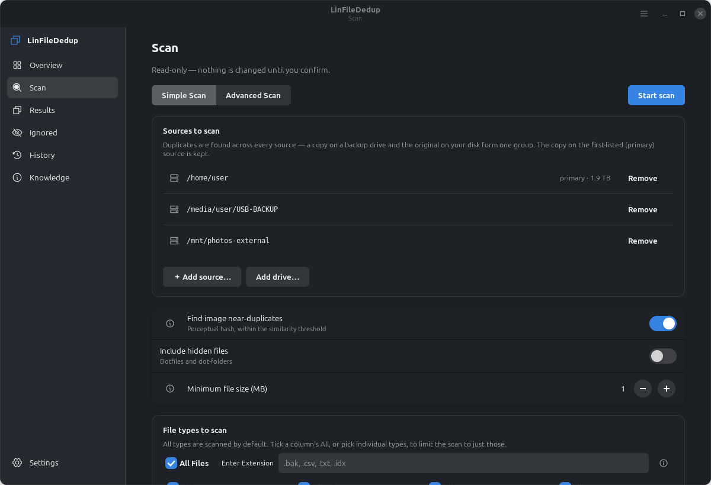

# DedupeDash

**Find and safely remove duplicate and near-duplicate files — with real care for images,
backups, and your confidence before anything is deleted.**

DedupeDash (`linfilededuplication`) is a native Linux desktop app for Debian 12/13 and Linux
Mint, built with **GTK 4 + libadwaita**. It finds exact duplicates, visually similar images,
and near-identical documents; flags probable backups; and lets you reclaim space **safely** —
nothing is changed until you review the groups and confirm, and removals go to Trash by default.



> Part of the MensuraMedia `lin-*` family of Linux utilities, built on the house
> `gtk4-dashboard-template` pattern. Runs entirely locally — no accounts, no network, no telemetry.

---

## Table of contents

- [Feature tour](#feature-tour)
- [Everything DedupeDash does](#everything-dedupedash-does)
- [Desktop integration](#desktop-integration)
- [Install](#install)
- [Usage](#usage)
- [How it works (architecture & services)](#how-it-works-architecture--services)
- [Development](#development)
- [Roadmap](#roadmap)
- [License](#license)
- [Credits](#credits)

---

## Feature tour

### SpotCheck — confirm before you remove

A large side-by-side view of a duplicate group. See each file's real content — full image
previews or readable document snippets — with the keeper first, so you can be sure before
acting. It is a gate, not an actor: closing it changes nothing.



### Backups, guidance, and scan scope

| Probable backups in Results | Knowledge (searchable glossary + FAQ) |
| --- | --- |
|  |  |

| Scan scope & backup settings | |
| --- | --- |
|  | |

### The basics

| Overview | Scan |
| --- | --- |
|  |  |

Interactive design mockups (light and dark) live in
[`docs/mockups/dedupedash-mockups.html`](docs/mockups/dedupedash-mockups.html).

---

## Everything DedupeDash does

### Matching engine

- **Exact duplicates** — a fast, layered pipeline: size pre-filter → progressive partial hash
  (xxHash or BLAKE2b) → full **SHA-256** → optional **byte-for-byte** verification. A match is
  a real match, never a hash coincidence.
- **Image near-duplicates** — perceptual hashing (aHash/dHash/pHash) groups images that look
  the same after resizing, cropping, or re-saving, with a tunable Hamming-distance threshold.
- **Near-identical content (Advanced)** — **content-defined chunking** fingerprints files by
  shift-resistant anchors and groups documents that share most content even after an edit or
  insertion.
- **Fuzzy hashing (Advanced)** — TLSH / ssdeep (when installed) catch near-identical binaries,
  documents, and text that differ by small edits.
- **Metadata & filename signals (Advanced)** — EXIF capture time and camera, plus filename
  similarity, enrich matching and display.

### Simple and Advanced tiers

- **Simple Scan** — exact duplicates + image near-duplicates, with sensible defaults. What
  most people need.
- **Advanced Scan** — adds the content-similarity, fuzzy, and metadata passes for documents
  and binaries, plus finer control.

### Keep policy

Every group keeps exactly one file (the **keeper**); the rest become candidates. The order:
highest resolution (images) → largest size → original (non-derived) filename → preferred folder
→ oldest file. Nothing derived is ever kept over an original.

### Backup awareness

- **Probable Backup** marker (icon + words, colourblind-safe) on files that look like backups —
  by name (`~`, `.bak`, `.old`, `backup`, `copy`, `vN`), embedded date stamps, backup folders,
  or dated sibling sets.
- **Newest / Older** age indicators so you can keep the most recent backup and clear the stale
  ones — the keep policy prefers the newest in a backup group.
- Detection is advisory: backups are **never** removed automatically.

### SpotCheck & content previews

- Large keeper-first comparison of a group, opened from Results.
- **Preview providers** show read-only snippets by type: full **images**; first lines of
  **text/code/config**; first-page text of **PDF** (via poppler or pypdf); paragraphs / sheet
  names of **office** documents (docx/odt/pptx/xlsx); entry lists of **archives**; and a
  metadata card for anything else. Providers never execute a file, follow links out, or touch
  the network, and are bounded by size/time budgets.

### Scan scope (exclusions)

Presets that skip files an app or the OS can recreate — **system files, caches, package/build
artifacts, version-control internals, app/runtime files, stubs, and Trash** — plus custom
globs. Excluded paths are never scanned **and never removable**.

### In-app guidance

- **Info icons** — a small `(i)` next to anything that could confuse; hover or focus it for a
  plain-language explanation, with a **Learn more** link into the Knowledge page.
- **Knowledge page** — a searchable, offline glossary and FAQ defining every term, file kind,
  and action you meet (duplicate, perceptual hash, hard link, backup file, system file, and more).

### Safety

- Read-only scans; nothing removed without an `Adw.AlertDialog` confirmation.
- **Dry-run preview** by default; **Move to Trash** (recoverable) or **hard-link** (reclaim
  space, keep every path) instead of permanent deletion.
- Protected system paths refused; a group's keeper can never be deleted; unreadable groups are
  skipped, never treated as removable.

### Desktop-native

GTK 4 + libadwaita, automatic light/dark, your GNOME/Cinnamon accent, keyboard-navigable,
screen-reader labelled, responsive.

---

## Desktop integration

- **Application launcher & menu item** — a `.desktop` entry installs DedupeDash into your
  applications menu; it also registers for folders (open a folder "with DedupeDash").
- **App icon** — an original icon shipped in `hicolor` (scalable SVG + 16–256 px PNGs), used in
  the menu, the window, and **Alt-Tab** (via `StartupWMClass` / WM_CLASS matching).
- **Panel / system-tray icon** — an optional `XApp.StatusIcon` (Mint, Cinnamon, and others):
  left-click opens the window, and the tray menu offers Open, New scan, and Quit. Closing the
  window then minimises to the tray. A detected capability — the app runs fine without a tray.
- **Command line** — `linfilededuplication [folder]` launches a scan on a folder.

---

## Install

### From the `.deb`

```bash
scripts/build-deb.sh
sudo apt install ./dist/linfilededuplication_0.1.0_all.deb
```

Depends on `python3-gi`, `python3-gi-cairo`, `gir1.2-gtk-4.0`, `gir1.2-adw-1`. Recommends
`python3-pil`, `python3-imagehash`, `python3-xxhash`, `gir1.2-xapp-1.0` (tray). Suggests
`python3-tlsh` (fuzzy) and `poppler-utils` (PDF previews). Optional pieces are detected at
runtime and degrade gracefully when absent.

### From source (development)

```bash
sudo apt install python3-gi python3-gi-cairo gir1.2-gtk-4.0 gir1.2-adw-1 python3-pil gir1.2-xapp-1.0
git clone https://github.com/MensuraMedia/linfilededuplication.git
cd linfilededuplication
python3 -m venv --system-site-packages .venv
.venv/bin/pip install xxhash imagehash py-tlsh        # optional extras
./run.sh
```

### System / user install without a package

```bash
scripts/install.sh            # ~/.local (user)
scripts/install.sh --system   # /usr/local (sudo)
scripts/uninstall.sh          # remove
```

---

## Usage

1. Open **Scan**, choose a folder, pick **Simple** or **Advanced**, and start.
2. Watch duplicate groups appear on **Results** as the scan runs.
3. Review each group — the keeper is highlighted; extras are pre-selected. Open **SpotCheck**
   to compare content, and check the **Probable backup** / **Newest / Older** markers.
4. Choose **Move to Trash** or **Hard-link**, confirm, and reclaim the space.

Tune matching, backups, safety, and **Scan scope** in **Settings**. Hover any `(i)` for help,
or open **Knowledge** to search terms.

---

## How it works (architecture & services)

Strict layering, one-way dependencies (UI → services → core; nothing points back up).

```
src/linfilededuplication/
  core/       pure Python, NO GTK (enforced by tests/core/test_purity.py)
    scanner.py          the pipeline: walk -> size -> progressive -> SHA-256 -> verify
    hashers.py          size / xxHash / SHA-256 / byte-for-byte
    image_perceptual.py perceptual image hashing + Hamming clustering
    chunking.py         content-defined anchor sampling + Jaccard similarity
    fuzzy.py            TLSH / ssdeep fuzzy hashing (optional)
    metadata.py         EXIF + filename similarity
    backup_detect.py    probable-backup signals + age ranking
    exclusions.py       scan-scope presets + custom globs
    policy.py           keep/delete ranking (incl. keep-newest for backups)
    preview.py          read-only content previews for SpotCheck
    glossary.py         load + search the local glossary/FAQ
  services/   GTK <-> core bridge
    scan_controller.py  worker thread -> queue -> GLib drain (16 ms / 8 ms budget)
    actions.py          Trash / hard-link with protected-path guards
    tray.py             optional XApp status icon
  ui/         Adwaita shell: window, sidebar, pages/, widgets/ (main thread only)
  config/     settings (tolerant JSON), layout
```

The engine runs on a worker thread and streams results to the UI through a drained queue, so
the window never freezes and a scan can always be cancelled. The `core/` package imports no GTK
and is covered by unit and golden tests, so it can back a future CLI or daemon unchanged.

See [`docs/CONCEPT.md`](docs/CONCEPT.md) for the full technical design and
[`docs/SPOTCHECK.md`](docs/SPOTCHECK.md) for the SpotCheck / backup / guidance features.

---

## Development

```bash
pytest -q                     # tests: pure core runs anywhere; UI smoke needs a display/xvfb
python3 -m linfilededuplication --smoke   # build every page headless
ruff check src tests          # lint
scripts/build-deb.sh          # build the .deb
scripts/backup.sh             # timestamped local backup of the source
```

Core is pure and guarded: `tests/core/test_purity.py` imports every `core` module with GTK
blocked, so a stray GTK import fails the build.

---

## Roadmap

Done: the exact engine, image near-duplicates, Advanced Scan (content similarity, fuzzy,
metadata), backups, SpotCheck, previews, exclusions, info icons, the Knowledge page, and desktop
integration (launcher, menu, tray, Alt-Tab, icon, `.deb`). Next: a headless CLI, a Flatpak,
SpotCheck synced-zoom and A/B difference view, and audio/video preview providers. Details in
[`docs/CONCEPT.md`](docs/CONCEPT.md).

---

## License

Released under the **Creative Commons Attribution–NonCommercial 4.0 International License
(CC BY-NC 4.0)**. You are welcome to use, copy, modify, and redistribute DedupeDash for any
non-commercial purpose, with attribution. **Commercial use requires prior written permission** —
we're happy to talk; please reach out. Full terms in [`LICENSE.md`](LICENSE.md).

## Credits

- Icons from [Phosphor Icons](https://phosphoricons.com) (MIT); the app icon is original.
- Built by **MensuraMedia** on the `gtk4-dashboard-template` house pattern.
