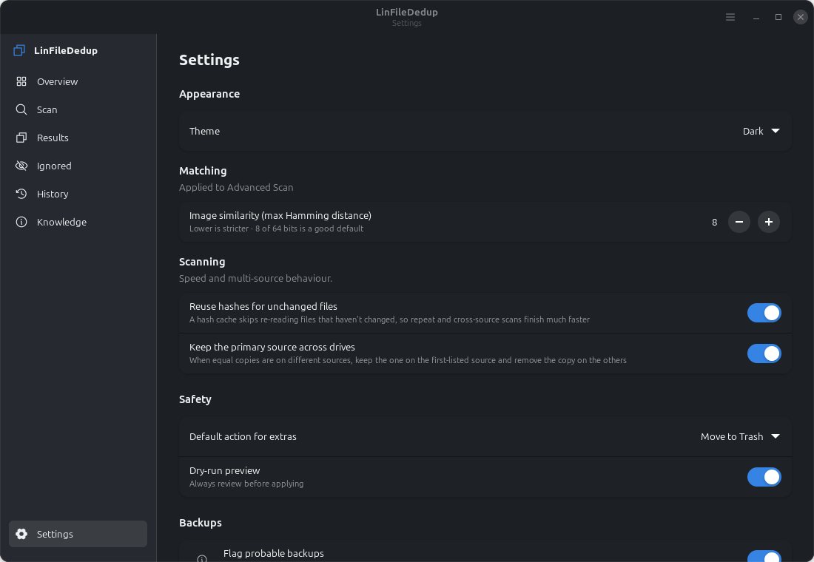

# DedupeDash

**Find and safely remove duplicate and near-duplicate files — with real care for images.**

DedupeDash (`linfilededuplication`) is a native Linux desktop app for Debian 12/13 and Linux
Mint, built with **GTK 4 + libadwaita**. It finds exact duplicate files and visually similar
images across a folder, then helps you reclaim the space **safely** — nothing is changed until
you review the duplicate groups and confirm, and removals go to Trash by default.


> Part of the MensuraMedia `lin-*` family of Linux utilities. Built on the house
> `gtk4-dashboard-template` pattern.

---

## What it does

- **Finds exact duplicates** using a fast, layered pipeline: a size pre-filter, a progressive
  partial hash, a full **SHA-256**, and an optional byte-for-byte verification — so a match is
  a real match, never a hash coincidence.
- **Finds near-duplicate images** with perceptual hashing (aHash/dHash/pHash), grouping images
  that look the same even after resizing or re-compression.
- **Keeps the best copy automatically.** For images it always keeps the **highest-resolution**
  version, so a full-resolution original outranks a thumbnail or a resized copy — never the
  other way around.
- **Removes extras safely.** A dry-run preview, a clear confirmation, and Trash (recoverable)
  by default — or replace duplicates with **hard links** to reclaim space without losing any
  path.

## Features

**Matching**
- Size pre-filter → progressive hash (xxHash / BLAKE2b) → SHA-256 → byte-for-byte verify
- Perceptual image near-duplicates with a tunable Hamming-distance threshold
- Two tiers: **Simple Scan** (exact + images, sensible defaults) and **Advanced Scan**
  (chunking, fuzzy hashing, metadata and a weighted keep policy — rolling out)

**Keep / delete policy**
- Ranks each group and marks one keeper: highest resolution → largest size → original
  (non-derived) filename → preferred folder → oldest file
- Every rule is visible; nothing derived is ever kept over an original

**Safety**
- Read-only scans; nothing is removed without an explicit confirmation dialog
- Move to Trash (recoverable), hard-link, or dry-run — your choice
- Protected system paths are refused; a group's keeper can never be deleted

**Confidence & guidance**
- **SpotCheck** — a large side-by-side view that shows each file's real content (image
  previews or document snippets) so you can confirm duplicates before removing them
- **Probable backup** markers with a clear **Newest / Older** indication, so you can keep the
  most recent backup and clear out the stale ones
- **Info icons** throughout — hover or focus the `(i)` for a plain-language explanation of any
  term, file kind, or action
- **Scan scope** presets that skip system files, caches, and other app- or OS-recreatable
  files (excluded paths are never removed)
- A searchable, offline **Knowledge** page defining every term you meet

**Desktop-native**
- GTK 4 + libadwaita, automatic light/dark, the accent you set in GNOME/Cinnamon
- Keyboard-navigable, screen-reader labels, responsive layout
- Runs entirely locally — no accounts, no network, no telemetry

## Screenshots

### SpotCheck — confirm before you remove


### Backups, guidance and scan scope

| Backups in Results | Knowledge (glossary + FAQ) |
| --- | --- |
|  |  |

| Scan scope & backup settings | |
| --- | --- |
|  | |

### The basics

| Overview | Scan |
| --- | --- |
|  |  |

| Results | Settings |
| --- | --- |
|  |  |

Interactive design mockups (light and dark) are in
[`docs/mockups/dedupedash-mockups.html`](docs/mockups/dedupedash-mockups.html).

## Install

### From a `.deb`

```bash
scripts/build-deb.sh
sudo apt install ./dist/linfilededuplication_0.1.0_all.deb
```

The package depends on `python3-gi`, `python3-gi-cairo`, `gir1.2-gtk-4.0`, `gir1.2-adw-1`,
and recommends `python3-pil`, `python3-imagehash`, `python3-xxhash` for image matching and
faster hashing.

### From source (development)

```bash
sudo apt install python3-gi python3-gi-cairo gir1.2-gtk-4.0 gir1.2-adw-1 python3-pil
git clone https://github.com/MensuraMedia/linfilededuplication.git
cd linfilededuplication
python3 -m venv --system-site-packages .venv
.venv/bin/pip install xxhash imagehash        # optional extras
./run.sh
```

The optional libraries are detected at runtime; without them the app still runs and simply
disables image near-duplicate detection with a hint.

## Usage

1. Open **Scan**, choose a folder, pick **Simple** or **Advanced**, and start.
2. Watch groups appear on **Results** as the scan runs.
3. Review each group — the keeper is highlighted; the extras are pre-selected.
4. Choose **Move to Trash** or **Hard-link**, confirm, and reclaim the space.

You can also launch a scan on a folder directly:

```bash
linfilededuplication ~/Pictures
```

## How it works

DedupeDash keeps a strict separation between a **pure engine** and the **UI**:

- `core/` — the scan pipeline and keep policy, pure Python with no GTK imports (enforced by a
  test), so it is headless-testable and reusable from a future CLI.
- `services/` — a controller that runs the scan on a worker thread and drains its results onto
  the GTK main loop, so the window never freezes and a scan can always be cancelled.
- `ui/` — the Adwaita shell: a sidebar, stacked pages, and the results view.

See [`docs/CONCEPT.md`](docs/CONCEPT.md) for the full technical design and roadmap.

## Development

```bash
pytest -q                     # tests (pure core runs anywhere)
python3 -m linfilededuplication --smoke   # build every page headless
ruff check src tests          # lint
scripts/build-deb.sh          # build the .deb
```

## Roadmap

P0–P5 (foundation, exact engine, threaded runner, Simple Scan UI, image near-duplicates) are
in place. Next: Advanced Scan signals (content-defined chunking, fuzzy hashing, metadata),
a headless CLI, and a Flatpak. Details in [`docs/CONCEPT.md`](docs/CONCEPT.md).

## License

Released under the **Creative Commons Attribution–NonCommercial 4.0 International License
(CC BY-NC 4.0)**. You are welcome to use, copy, modify, and redistribute DedupeDash for any
non-commercial purpose, with attribution. **Commercial use requires prior written permission**
— we're happy to talk; please reach out. Full terms in [`LICENSE.md`](LICENSE.md).

## Credits

- Icons from [Phosphor Icons](https://phosphoricons.com) (MIT).
- Built by **MensuraMedia** on the `gtk4-dashboard-template` house pattern.
